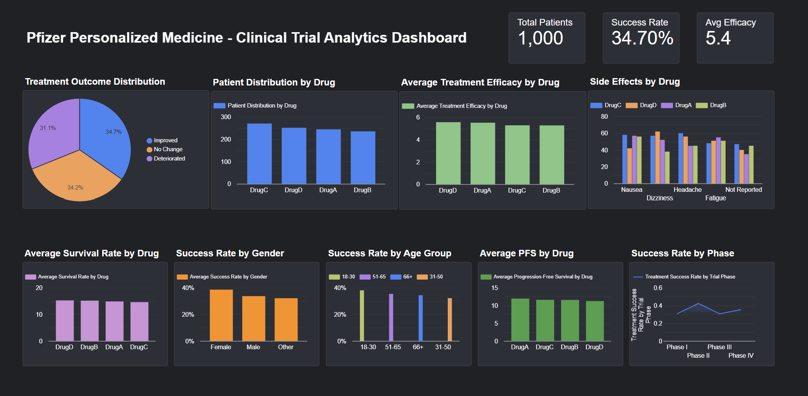

# Pfizer Personalized Medicine — Clinical Trial Analytics

## Project Overview

This project analyzes clinical trial data to identify patterns in treatment outcomes, drug efficacy, patient demographics, genetic factors, side effects, survival rates, and progression-free survival.

The analysis was performed using **Microsoft Excel** for data cleaning, exploratory analysis, PivotTables, and visualizations, followed by an interactive **Looker Studio dashboard** for communicating key findings.

## 🔗 Interactive Dashboard

[View Interactive Looker Studio Dashboard](https://datastudio.google.com/s/giN0IzKvWAU)

### Dashboard Preview

 

### 📑 Project Presentation

The complete project presentation covering the analysis, key findings, visualizations, and dashboard is available here:

[View Project Presentation](./Pfizer_Clinical_Trial_Analytics_Presentation.pptx)

## Business Objective

The objective is to understand how patient characteristics and treatment-related factors are associated with clinical outcomes and to present these findings in a format that can support data-driven decision-making.

Key areas analyzed include:

- Treatment outcomes across drugs
- Drug efficacy and treatment success
- Patient age and gender patterns
- Side-effect distribution
- Dose and treatment duration
- Genetic mutation status
- Gene expression and biomarker levels
- Survival rate
- Progression-free survival
- Trial phase performance

## Tools & Technologies

- **Microsoft Excel**
  - Data cleaning
  - Data quality validation
  - PivotTables
  - Statistical analysis
  - Charts and visualizations
- **Looker Studio**
  - Interactive dashboard
  - KPI reporting
  - Data visualization

## Data Cleaning

The dataset was reviewed for:

- Missing values
- Duplicate patient records
- Data consistency
- Numerical ranges
- Date validity
- Categorical values
- Treatment and dosage fields

Missing values in fields such as `Medical_History`, `Genomic_Profile`, `Adverse_Events`, and `Side_Effects` were standardized as **"Not Reported"** rather than removing the associated patient records.

Additional analytical fields were created, including:

- Age Group
- Numeric Dose
- Numeric Dose Administered
- Numeric Side-Effect Encoding
- Numeric Treatment-Outcome Encoding

## Analysis

The project includes:

- **22 PivotTable analyses**
- **3 scatter-plot analyses**
- **15 Excel visualizations**
- **Interactive Looker Studio dashboard**

The analyses examine relationships between drugs, demographics, treatment outcomes, efficacy, survival, progression-free survival, genetic factors, side effects, and treatment characteristics.

## Key Findings

- The dataset contains **1,000 patient records**.
- Overall observed treatment success rate was **34.7%**.
- Average treatment efficacy score was approximately **5.4/10**.
- Treatment outcomes were distributed across Improved, No Change, and Deteriorated groups.
- Observed treatment outcomes varied across drugs and patient characteristics.
- Mutation status showed differences in observed treatment outcomes and efficacy across drugs.
- Progression-free survival and survival rate were analyzed across multiple treatment and patient dimensions.

> These findings describe associations observed within the dataset and should not be interpreted as causal clinical conclusions.

## Dashboard

The Looker Studio dashboard summarizes the analysis through:

- Total Patients
- Overall Treatment Success Rate
- Average Treatment Efficacy
- Treatment Outcome Distribution
- Patient Distribution by Drug
- Average Treatment Efficacy by Drug
- Side Effects by Drug
- Average Survival Rate by Drug
- Success Rate by Gender
- Treatment Success Rate by Age Group
- Average Progression-Free Survival by Drug
- Treatment Success Rate by Trial Phase

## Repository Structure

```text
Pfizer-personalized-medicine-analysis/
│
├── Pfizer_Personalized_Medicine_Analysis.xlsx
│   └── Excel data cleaning, analysis and visualizations
│
├── Pfizer_Clinical_Trial_Analytics_Presentation.pptx
│   └── Project presentation
│
├── Pfizer_Personalized_Medicine_Dashboard1.png
│   └── Looker Studio dashboard preview
│
├── Pfizer_Personalized_Medicine_Dashboard2.png
│   └── Additional dashboard view
│
├── Pfizer_Personalized_Medicine_Dashboard3.png
│   └── Additional dashboard view
│
├── Pfizer_Personalized_Medicine_Dashboard4.png
│   └── Additional dashboard view
│
└── README.md
    └── Project overview, methodology and key findings
